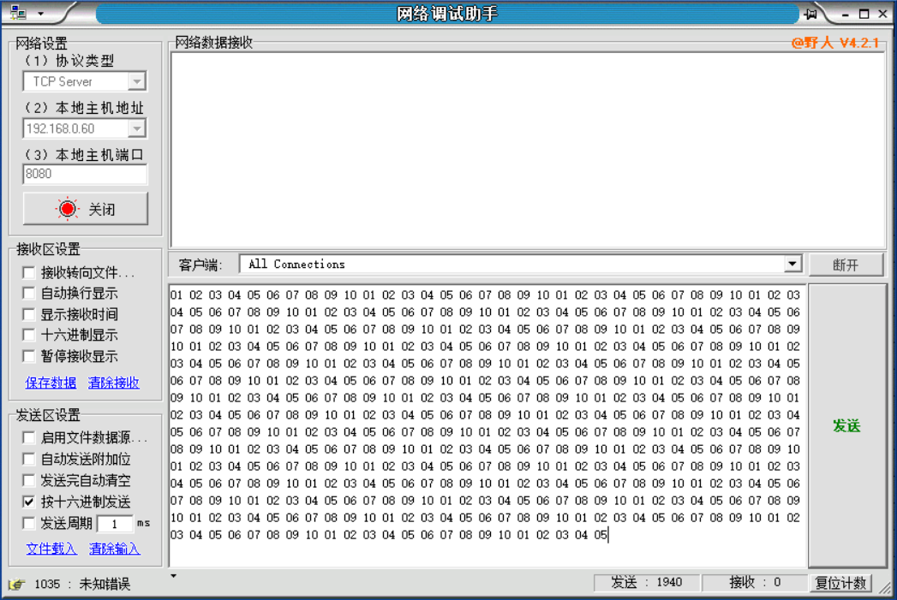

bug描述--大量接收数据出现宕机
=============================

1.  测试人员：树华；

2.  提交时间：(2017.1.29)；

3.  缺陷等级（5级分类）：A类；

4.  缺陷优先级：重要不紧急；

5.  测试环境：

    -   操作系统：win10(1607)

    -   测试设备：超纬stm32f107vct6开发板

    -   测试软件：串口助手(xcom\_v2.0)，网络调试助手(NetAssist)

6.  缺陷发生位置（模块）：tcpclient.c；

7.  预期结果：正常接收数据，无宕机；

8.  实际结果：一旦瞬间发送大量数据，会出现宕机，进入HardFault\_Handler中断；

9.  重现步骤：

    -   使用网络调试助手发送较长数据（大于485字节）

10.  备注：此bug暂时找不到解决办法修复，但在数量较少，发送速度较慢的情况下不会产生较大影响。

11.  附件：

    -   测试数据：

        

